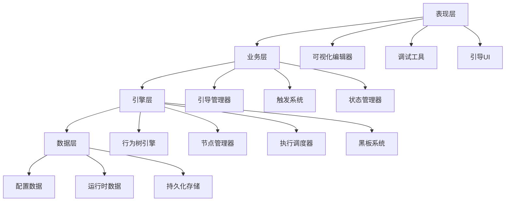

# 行为树新手引导系统

## 📋 项目概述

行为树新手引导系统是一个基于行为树技术的高级新手引导解决方案，旨在为游戏提供更加灵活、强大和可维护的引导体验。该系统采用模块化设计，支持复杂的逻辑表达、可视化编辑和实时调试。

## 🎯 核心特性

### ✨ 强大的逻辑表达能力
- **复杂条件组合**：支持AND、OR、NOT等逻辑运算
- **动态条件检测**：实时响应游戏状态变化
- **分支流程控制**：根据不同条件执行不同引导路径
- **循环与重试机制**：支持重复执行和错误恢复

### 🎨 可视化编辑器
- **拖拽式节点编辑**：直观的可视化编辑界面
- **实时预览功能**：即时查看引导流程效果
- **参数配置面板**：便捷的节点参数设置
- **调试模式支持**：可视化调试和断点功能

### 🔧 高度可扩展性
- **插件式节点系统**：轻松添加自定义节点类型
- **模块化架构设计**：各组件独立可替换
- **事件驱动机制**：灵活的事件订阅和分发
- **多语言本地化**：完整的国际化支持

### 📊 数据分析与监控
- **详细的执行统计**：完成率、跳过率、耗时分析
- **用户行为追踪**：记录用户操作路径和偏好
- **性能监控**：实时监控系统性能指标
- **A/B测试支持**：支持多版本引导对比测试

## 📁 项目结构

```
BehaviorTree/
├── 📄 README.md                           # 项目总览文档
├── 📁 设计文档/                           # 设计文档目录
│   ├── 📄 行为树新手引导系统设计文档.md    # 核心设计文档
│   └── 📄 节点设计规范.md                  # 节点设计规范
├── 📁 架构方案/                           # 架构设计目录
│   └── 📄 系统架构设计方案.md              # 系统架构方案
├── 📁 配置示例/                           # 配置示例目录
│   └── 📄 完整引导配置示例.json            # 完整配置示例
├── 📁 流程图/                             # 流程图目录
│   └── 📄 行为树执行流程图.md              # 执行流程图
└── 📁 开发指南/                           # 开发指南目录
    └── 📄 开发实施指南.md                  # 开发实施指南
```

## 🚀 快速开始

### 1. 系统架构概览



### 2. 核心组件介绍

#### 🧠 行为树引擎
- **BehaviorTreeEngine**：核心执行引擎
- **NodeExecutor**：节点执行器
- **ExecutionScheduler**：执行调度器
- **Blackboard**：数据共享黑板

#### 🎮 引导业务层
- **TutorialManager**：引导流程管理
- **TriggerSystem**：智能触发系统
- **StateManager**：状态管理器
- **ProgressTracker**：进度追踪器

#### 🎨 可视化编辑器
- **BehaviorTreeEditor**：可视化编辑器
- **NodeInspector**：节点属性检视器
- **DebugWindow**：调试窗口
- **PreviewSystem**：实时预览系统

### 3. 节点类型系统

#### 控制节点 (Control Nodes)
```json
{
  "Sequence": "顺序执行所有子节点",
  "Selector": "选择第一个成功的子节点",
  "Parallel": "并行执行多个子节点",
  "Random": "随机选择子节点执行"
}
```

#### 条件节点 (Condition Nodes)
```json
{
  "PlayerLevelCondition": "检查玩家等级",
  "GameStateCondition": "检查游戏状态",
  "UIStateCondition": "检查UI状态",
  "TimeCondition": "检查时间条件"
}
```

#### 动作节点 (Action Nodes)
```json
{
  "ShowMessageAction": "显示引导消息",
  "HighlightUIAction": "高亮UI元素",
  "WaitForClickAction": "等待用户点击",
  "PlayAnimationAction": "播放动画效果"
}
```

#### 装饰节点 (Decorator Nodes)
```json
{
  "RepeatDecorator": "重复执行子节点",
  "ConditionalDecorator": "条件装饰器",
  "TimeoutDecorator": "超时装饰器",
  "CooldownDecorator": "冷却装饰器"
}
```

## 📖 文档导航

### 🎯 设计文档
- **[行为树新手引导系统设计文档](设计文档/行为树新手引导系统设计文档.md)**
  - 系统设计目标和核心价值
  - 详细的功能需求分析
  - 完整的技术实现方案
  - 数据分析和监控策略

- **[节点设计规范](设计文档/节点设计规范.md)**
  - 节点分类和设计原则
  - 节点参数配置系统
  - 节点可视化设计规范
  - 性能优化和调试支持

### 🏗️ 架构方案
- **[系统架构设计方案](架构方案/系统架构设计方案.md)**
  - 总体架构设计
  - 核心组件关系图
  - 详细的技术架构
  - 扩展性和性能优化

### 💡 配置示例
- **[完整引导配置示例](配置示例/完整引导配置示例.json)**
  - 商店引导流程示例
  - 战斗系统引导示例
  - 背包系统引导示例
  - 完整的JSON配置格式

### 📊 流程图
- **[行为树执行流程图](流程图/行为树执行流程图.md)**
  - 系统总体执行流程
  - 节点执行详细流程
  - 错误处理与恢复流程
  - 性能监控流程

### 🛠️ 开发指南
- **[开发实施指南](开发指南/开发实施指南.md)**
  - 开发环境准备
  - 分阶段开发计划
  - 代码规范和最佳实践
  - 测试策略和部署指南

## 🎮 使用场景

### 🎯 新手引导
- **基础操作引导**：UI交互、基本操作教学
- **功能介绍引导**：新功能解锁和使用指导
- **进阶教程引导**：复杂系统的深度教学

### 🎪 动态提示
- **智能提示系统**：根据用户行为动态显示提示
- **功能推荐**：基于用户偏好推荐相关功能
- **操作优化建议**：提供更高效的操作方式

### 📈 用户引导
- **个性化引导**：根据用户类型定制引导内容
- **渐进式引导**：分层次逐步深入的引导体验
- **自适应引导**：根据用户反馈调整引导策略

## 🔧 技术优势

### 🚀 性能优势
- **高效执行**：优化的行为树执行算法
- **内存管理**：智能的对象池和内存回收
- **异步处理**：非阻塞的异步操作支持
- **批量优化**：批量处理减少性能开销

### 🛡️ 稳定性保障
- **错误恢复**：完善的错误处理和恢复机制
- **状态一致性**：可靠的状态管理和同步
- **容错设计**：优雅的降级和容错处理
- **调试支持**：强大的调试和诊断工具

### 🔄 可维护性
- **模块化设计**：清晰的模块边界和职责分离
- **代码复用**：高度可复用的组件设计
- **文档完善**：详细的API文档和使用指南
- **版本管理**：完整的版本控制和迁移支持

## 📊 对比分析

### 🆚 与传统引导系统对比

| 特性 | 传统引导系统 | 行为树引导系统 |
|------|-------------|----------------|
| **逻辑表达能力** | 简单条件判断 | 复杂逻辑组合 |
| **可视化编辑** | 代码配置 | 拖拽式编辑器 |
| **扩展性** | 有限扩展 | 高度可扩展 |
| **调试能力** | 日志调试 | 可视化调试 |
| **维护成本** | 较高 | 较低 |
| **学习成本** | 低 | 中等 |
| **性能开销** | 低 | 中等 |

### 💡 适用场景建议

#### ✅ 推荐使用场景
- 复杂的引导逻辑需求
- 需要频繁调整引导流程
- 多人协作的大型项目
- 对用户体验要求较高的产品

#### ⚠️ 谨慎使用场景
- 简单的线性引导需求
- 资源受限的小型项目
- 团队技术能力有限
- 对性能要求极其苛刻的场景

## 🎯 项目价值

### 📈 业务价值
- **提升用户留存**：更好的引导体验减少用户流失
- **降低支持成本**：减少用户咨询和支持需求
- **加速功能采用**：提高新功能的使用率
- **数据驱动优化**：基于数据分析持续优化引导效果

### 🛠️ 技术价值
- **开发效率提升**：可视化编辑大幅提升开发效率
- **维护成本降低**：模块化设计降低维护复杂度
- **代码质量提升**：规范化的架构提升代码质量
- **团队协作优化**：清晰的分工和接口设计

### 🎮 用户价值
- **学习曲线平滑**：渐进式引导降低学习难度
- **个性化体验**：根据用户特点定制引导内容
- **操作效率提升**：智能提示提高操作效率
- **探索乐趣增加**：引导与探索的平衡设计

## 🚀 未来规划

### 📅 短期目标 (1-3个月)
- 完成核心引擎开发
- 实现基础节点类型
- 开发简单的可视化编辑器
- 完成基础功能测试

### 📅 中期目标 (3-6个月)
- 完善可视化编辑器功能
- 增加高级节点类型
- 实现完整的调试系统
- 优化性能和稳定性

### 📅 长期目标 (6-12个月)
- 支持AI驱动的智能引导
- 实现云端配置和热更新
- 开发移动端编辑器
- 建立完整的生态系统

## 📞 联系我们

如果您对行为树新手引导系统有任何疑问或建议，欢迎通过以下方式联系我们：

- **项目地址**：[GitHub Repository]
- **技术文档**：[Documentation Site]
- **问题反馈**：[Issue Tracker]
- **技术交流**：[Discussion Forum]

---

**让引导更智能，让体验更出色！** 🎯✨