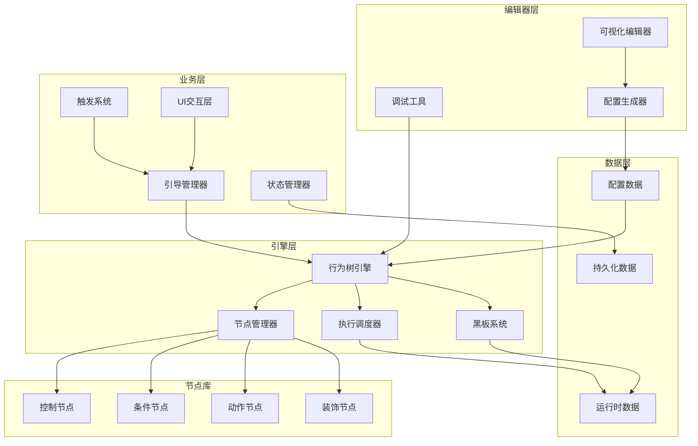

# 行为树新手引导系统架构设计方案

## 🏗️ 1. 总体架构概览

### 1.1 架构分层设计

```
┌─────────────────────────────────────────────────────────────┐
│                    表现层 (Presentation Layer)              │
├─────────────────────────────────────────────────────────────┤
│  ┌─────────────────┐  ┌─────────────────┐  ┌─────────────────┐ │
│  │  可视化编辑器    │  │   调试工具      │  │   监控面板      │ │
│  │  Visual Editor  │  │  Debug Tools    │  │ Monitor Panel   │ │
│  └─────────────────┘  └─────────────────┘  └─────────────────┘ │
├─────────────────────────────────────────────────────────────┤
│                    业务层 (Business Layer)                  │
├─────────────────────────────────────────────────────────────┤
│  ┌─────────────────┐  ┌─────────────────┐  ┌─────────────────┐ │
│  │   引导管理器     │  │   触发系统      │  │   状态管理器    │ │
│  │Tutorial Manager │  │ Trigger System  │  │ State Manager   │ │
│  └─────────────────┘  └─────────────────┘  └─────────────────┘ │
├─────────────────────────────────────────────────────────────┤
│                    引擎层 (Engine Layer)                    │
├─────────────────────────────────────────────────────────────┤
│  ┌─────────────────┐  ┌─────────────────┐  ┌─────────────────┐ │
│  │  行为树引擎     │  │   节点管理器    │  │   执行调度器    │ │
│  │BehaviorTree     │  │ Node Manager    │  │   Scheduler     │ │
│  │    Engine       │  │                 │  │                 │ │
│  └─────────────────┘  └─────────────────┘  └─────────────────┘ │
├─────────────────────────────────────────────────────────────┤
│                    数据层 (Data Layer)                      │
├─────────────────────────────────────────────────────────────┤
│  ┌─────────────────┐  ┌─────────────────┐  ┌─────────────────┐ │
│  │   配置数据      │  │   运行时数据    │  │   持久化数据    │ │
│  │ Config Data     │  │ Runtime Data    │  │Persistent Data  │ │
│  └─────────────────┘  └─────────────────┘  └─────────────────┘ │
└─────────────────────────────────────────────────────────────┘
```

### 1.2 核心组件关系图



## 🔧 2. 核心引擎架构

### 2.1 行为树引擎 (BehaviorTreeEngine)

#### 2.1.1 引擎核心类设计

```csharp
/// <summary>
/// 行为树引擎核心类
/// 负责行为树的创建、执行和管理
/// </summary>
public class BehaviorTreeEngine : MonoBehaviour
{
    // 单例模式
    public static BehaviorTreeEngine Instance { get; private set; }
    
    // 引擎配置
    [SerializeField] private BehaviorTreeEngineConfig config;
    
    // 核心组件
    private NodeManager nodeManager;
    private ExecutionScheduler scheduler;
    private BlackboardSystem blackboard;
    
    // 运行时数据
    private Dictionary<string, BehaviorTreeInstance> activeTrees;
    private Queue<BehaviorTreeInstance> pendingTrees;
    
    // 事件系统
    public event System.Action<string, NodeStatus> OnNodeExecuted;
    public event System.Action<string> OnTreeCompleted;
    public event System.Action<string, string> OnTreeError;
}
```

#### 2.1.2 行为树实例管理

```csharp
/// <summary>
/// 行为树实例
/// 表示一个正在运行的行为树
/// </summary>
public class BehaviorTreeInstance
{
    public string TreeId { get; private set; }
    public BehaviorTreeConfig Config { get; private set; }
    public BehaviorTreeNode RootNode { get; private set; }
    public BlackboardData Blackboard { get; private set; }
    public TreeExecutionContext Context { get; private set; }
    
    // 执行状态
    public TreeStatus Status { get; private set; }
    public float ExecutionTime { get; private set; }
    public int CurrentStep { get; private set; }
    
    // 生命周期方法
    public void Initialize(BehaviorTreeConfig config);
    public NodeStatus Tick(float deltaTime);
    public void Pause();
    public void Resume();
    public void Stop();
    public void Reset();
}
```

### 2.2 节点管理器 (NodeManager)

#### 2.2.1 节点注册与创建

```csharp
/// <summary>
/// 节点管理器
/// 负责节点的注册、创建和生命周期管理
/// </summary>
public class NodeManager
{
    // 节点类型注册表
    private Dictionary<string, System.Type> nodeTypeRegistry;
    
    // 节点工厂
    private Dictionary<string, INodeFactory> nodeFactories;
    
    // 节点对象池
    private Dictionary<System.Type, Queue<BehaviorTreeNode>> nodePools;
    
    /// <summary>
    /// 注册节点类型
    /// </summary>
    public void RegisterNodeType<T>(string typeName) where T : BehaviorTreeNode;
    
    /// <summary>
    /// 创建节点实例
    /// </summary>
    public BehaviorTreeNode CreateNode(string typeName, NodeConfig config);
    
    /// <summary>
    /// 回收节点实例
    /// </summary>
    public void RecycleNode(BehaviorTreeNode node);
}
```

#### 2.2.2 节点基类设计

```csharp
/// <summary>
/// 行为树节点基类
/// 所有节点都继承自此类
/// </summary>
public abstract class BehaviorTreeNode
{
    // 节点基本信息
    public string NodeId { get; protected set; }
    public string NodeType { get; protected set; }
    public NodeConfig Config { get; protected set; }
    
    // 节点关系
    public BehaviorTreeNode Parent { get; set; }
    public List<BehaviorTreeNode> Children { get; protected set; }
    
    // 执行状态
    public NodeStatus Status { get; protected set; }
    public float LastExecutionTime { get; protected set; }
    
    // 生命周期方法
    public virtual void Initialize(NodeConfig config) { }
    public abstract NodeStatus Execute(TreeExecutionContext context);
    public virtual void OnEnter(TreeExecutionContext context) { }
    public virtual void OnExit(TreeExecutionContext context) { }
    public virtual void OnReset() { }
    
    // 编辑器支持
    public virtual NodeMetadata GetMetadata() { return null; }
    public virtual void OnDrawGizmos() { }
}
```

### 2.3 执行调度器 (ExecutionScheduler)

#### 2.3.1 调度策略

```csharp
/// <summary>
/// 执行调度器
/// 负责行为树的执行调度和性能优化
/// </summary>
public class ExecutionScheduler
{
    // 调度配置
    private SchedulerConfig config;
    
    // 执行队列
    private PriorityQueue<BehaviorTreeInstance> executionQueue;
    private List<BehaviorTreeInstance> runningTrees;
    
    // 性能监控
    private PerformanceMonitor performanceMonitor;
    
    /// <summary>
    /// 调度策略枚举
    /// </summary>
    public enum SchedulingStrategy
    {
        RoundRobin,     // 轮询调度
        Priority,       // 优先级调度
        TimeSlicing,    // 时间片调度
        Adaptive        // 自适应调度
    }
    
    /// <summary>
    /// 执行一帧的调度
    /// </summary>
    public void TickScheduler(float deltaTime);
    
    /// <summary>
    /// 添加行为树到调度队列
    /// </summary>
    public void ScheduleTree(BehaviorTreeInstance tree);
    
    /// <summary>
    /// 从调度队列移除行为树
    /// </summary>
    public void UnscheduleTree(string treeId);
}
```

### 2.4 黑板系统 (BlackboardSystem)

#### 2.4.1 数据共享机制

```csharp
/// <summary>
/// 黑板系统
/// 提供行为树节点间的数据共享机制
/// </summary>
public class BlackboardSystem
{
    // 全局黑板
    private BlackboardData globalBlackboard;
    
    // 树级黑板
    private Dictionary<string, BlackboardData> treeBlackboards;
    
    // 数据变化监听
    private Dictionary<string, List<System.Action<object>>> dataChangeListeners;
    
    /// <summary>
    /// 黑板数据类
    /// </summary>
    public class BlackboardData
    {
        private Dictionary<string, object> data;
        private Dictionary<string, System.Type> dataTypes;
        
        public T GetValue<T>(string key);
        public void SetValue<T>(string key, T value);
        public bool HasKey(string key);
        public void RemoveKey(string key);
        public void Clear();
    }
}
```

## 🎮 3. 业务层架构

### 3.1 引导管理器 (TutorialManager)

#### 3.1.1 引导生命周期管理

```csharp
/// <summary>
/// 引导管理器
/// 负责引导的整体生命周期管理
/// </summary>
public class TutorialManager : MonoBehaviour
{
    // 单例模式
    public static TutorialManager Instance { get; private set; }
    
    // 核心组件引用
    private BehaviorTreeEngine treeEngine;
    private TriggerSystem triggerSystem;
    private StateManager stateManager;
    
    // 引导状态
    private Dictionary<string, TutorialState> tutorialStates;
    private string currentTutorialId;
    private TutorialExecutionContext currentContext;
    
    // 配置数据
    private Dictionary<string, TutorialConfig> tutorialConfigs;
    
    // 事件系统
    public event System.Action<string> OnTutorialStarted;
    public event System.Action<string> OnTutorialCompleted;
    public event System.Action<string> OnTutorialSkipped;
    public event System.Action<string, string> OnTutorialError;
    
    /// <summary>
    /// 引导状态枚举
    /// </summary>
    public enum TutorialState
    {
        NotStarted,     // 未开始
        Running,        // 运行中
        Paused,         // 暂停
        Completed,      // 已完成
        Skipped,        // 已跳过
        Error           // 错误状态
    }
}
```

#### 3.1.2 引导执行上下文

```csharp
/// <summary>
/// 引导执行上下文
/// 包含引导执行所需的所有上下文信息
/// </summary>
public class TutorialExecutionContext
{
    // 基本信息
    public string TutorialId { get; set; }
    public string PlayerId { get; set; }
    public float StartTime { get; set; }
    
    // 游戏状态
    public GameStateSnapshot GameState { get; set; }
    public PlayerDataSnapshot PlayerData { get; set; }
    public UIStateSnapshot UIState { get; set; }
    
    // 引导数据
    public Dictionary<string, object> TutorialData { get; set; }
    public List<string> CompletedSteps { get; set; }
    public string CurrentStepId { get; set; }
    
    // 性能数据
    public PerformanceMetrics Performance { get; set; }
    
    // 用户行为数据
    public List<UserAction> UserActions { get; set; }
}
```

### 3.2 触发系统 (TriggerSystem)

#### 3.2.1 触发器架构

```csharp
/// <summary>
/// 触发系统
/// 负责引导的自动触发和条件检测
/// </summary>
public class TriggerSystem : MonoBehaviour
{
    // 触发器注册表
    private Dictionary<string, ITutorialTrigger> registeredTriggers;
    
    // 触发器分组
    private Dictionary<TriggerType, List<ITutorialTrigger>> triggerGroups;
    
    // 触发历史
    private List<TriggerEvent> triggerHistory;
    
    // 性能优化
    private TriggerOptimizer optimizer;
    
    /// <summary>
    /// 触发器类型
    /// </summary>
    public enum TriggerType
    {
        Event,          // 事件触发
        Condition,      // 条件触发
        Time,           // 时间触发
        Location,       // 位置触发
        Composite       // 组合触发
    }
    
    /// <summary>
    /// 触发器接口
    /// </summary>
    public interface ITutorialTrigger
    {
        string TriggerId { get; }
        TriggerType Type { get; }
        int Priority { get; }
        
        bool CheckCondition(TriggerContext context);
        void OnTriggered(TriggerContext context);
        void Reset();
    }
}
```

#### 3.2.2 复杂触发条件支持

```csharp
/// <summary>
/// 复合触发器
/// 支持复杂的触发条件组合
/// </summary>
public class CompositeTrigger : ITutorialTrigger
{
    // 子触发器
    private List<ITutorialTrigger> childTriggers;
    
    // 组合逻辑
    private TriggerLogic logic;
    
    /// <summary>
    /// 触发器逻辑类型
    /// </summary>
    public enum TriggerLogic
    {
        And,            // 所有条件都满足
        Or,             // 任一条件满足
        Not,            // 条件不满足
        Sequence,       // 按顺序满足
        Parallel        // 并行满足
    }
    
    /// <summary>
    /// 条件表达式解析器
    /// </summary>
    public class TriggerExpressionParser
    {
        public ITutorialTrigger ParseExpression(string expression);
        public bool ValidateExpression(string expression);
        public List<string> GetVariables(string expression);
    }
}
```

### 3.3 状态管理器 (StateManager)

#### 3.3.1 状态持久化

```csharp
/// <summary>
/// 状态管理器
/// 负责引导状态的保存、恢复和同步
/// </summary>
public class StateManager
{
    // 状态存储
    private IStateStorage stateStorage;
    
    // 状态缓存
    private Dictionary<string, TutorialStateData> stateCache;
    
    // 状态同步
    private StateSynchronizer synchronizer;
    
    // 状态压缩
    private StateCompressor compressor;
    
    /// <summary>
    /// 引导状态数据
    /// </summary>
    [System.Serializable]
    public class TutorialStateData
    {
        public string tutorialId;
        public string currentStepId;
        public float progress;
        public long timestamp;
        public Dictionary<string, object> stepData;
        public List<string> completedSteps;
        public Dictionary<string, object> customData;
    }
    
    /// <summary>
    /// 状态存储接口
    /// </summary>
    public interface IStateStorage
    {
        void SaveState(string key, TutorialStateData state);
        TutorialStateData LoadState(string key);
        void DeleteState(string key);
        List<string> GetAllStateKeys();
    }
}
```

## 🎨 4. 编辑器架构

### 4.1 可视化编辑器 (VisualEditor)

#### 4.1.1 编辑器核心架构

```csharp
/// <summary>
/// 可视化编辑器主窗口
/// </summary>
public class BehaviorTreeEditorWindow : EditorWindow
{
    // UI组件
    private ToolbarView toolbar;
    private NodeLibraryView nodeLibrary;
    private GraphCanvasView graphCanvas;
    private PropertyPanelView propertyPanel;
    private DebugPanelView debugPanel;
    
    // 数据模型
    private BehaviorTreeEditorModel editorModel;
    private BehaviorTreeViewModel treeViewModel;
    
    // 命令系统
    private CommandManager commandManager;
    
    // 编辑器状态
    private EditorState currentState;
    
    /// <summary>
    /// 编辑器状态
    /// </summary>
    public enum EditorState
    {
        Editing,        // 编辑模式
        Debugging,      // 调试模式
        Preview,        // 预览模式
        Testing         // 测试模式
    }
}
```

#### 4.1.2 图形画布系统

```csharp
/// <summary>
/// 图形画布视图
/// 基于Unity GraphView实现的节点图编辑器
/// </summary>
public class GraphCanvasView : GraphView
{
    // 节点视图管理
    private Dictionary<string, NodeView> nodeViews;
    private Dictionary<string, EdgeView> edgeViews;
    
    // 选择和操作
    private SelectionManager selectionManager;
    private DragAndDropManager dragDropManager;
    
    // 视图控制
    private ViewTransform viewTransform;
    private GridBackground gridBackground;
    
    // 节点创建
    private NodeCreationMenu creationMenu;
    
    /// <summary>
    /// 节点视图基类
    /// </summary>
    public abstract class NodeView : Node
    {
        protected BehaviorTreeNode nodeData;
        protected NodeViewModel viewModel;
        
        // 视觉元素
        protected VisualElement titleContainer;
        protected VisualElement contentContainer;
        protected VisualElement inputContainer;
        protected VisualElement outputContainer;
        
        // 端口管理
        protected List<Port> inputPorts;
        protected List<Port> outputPorts;
        
        public abstract void UpdateView();
        public abstract void OnSelected();
        public abstract void OnDeselected();
    }
}
```

### 4.2 调试工具 (DebugTools)

#### 4.2.1 实时调试器

```csharp
/// <summary>
/// 行为树调试器
/// 提供实时调试和监控功能
/// </summary>
public class BehaviorTreeDebugger
{
    // 调试目标
    private BehaviorTreeInstance targetTree;
    
    // 调试状态
    private DebuggerState state;
    private List<DebugBreakpoint> breakpoints;
    private DebugCallStack callStack;
    
    // 监控数据
    private PerformanceProfiler profiler;
    private MemoryMonitor memoryMonitor;
    private ExecutionTracer tracer;
    
    /// <summary>
    /// 调试器状态
    /// </summary>
    public enum DebuggerState
    {
        Detached,       // 未附加
        Attached,       // 已附加
        Running,        // 运行中
        Paused,         // 暂停
        Stepping        // 单步执行
    }
    
    /// <summary>
    /// 调试断点
    /// </summary>
    public class DebugBreakpoint
    {
        public string nodeId;
        public BreakpointType type;
        public string condition;
        public bool enabled;
        
        public enum BreakpointType
        {
            OnEnter,        // 进入时断点
            OnExit,         // 退出时断点
            OnCondition     // 条件断点
        }
    }
}
```

## 📊 5. 数据架构

### 5.1 配置数据结构

#### 5.1.1 行为树配置格式

```json
{
  "behaviorTreeConfig": {
    "metadata": {
      "id": "tutorial_shop_guide",
      "name": "商店引导",
      "version": "1.0.0",
      "author": "策划团队",
      "description": "引导玩家了解商店系统",
      "tags": ["新手", "商店", "基础"],
      "priority": "High",
      "estimatedDuration": 120
    },
    "triggers": [
      {
        "type": "CompositeTrigger",
        "logic": "And",
        "conditions": [
          {
            "type": "PlayerLevelCondition",
            "parameters": {
              "minLevel": 3,
              "maxLevel": 10
            }
          },
          {
            "type": "GameStateCondition",
            "parameters": {
              "stateName": "shop.unlocked",
              "expectedValue": true
            }
          }
        ]
      }
    ],
    "behaviorTree": {
      "rootNode": {
        "id": "root",
        "type": "Sequence",
        "children": [
          {
            "id": "check_prerequisites",
            "type": "Parallel",
            "parameters": {
              "successPolicy": "All",
              "failurePolicy": "Any"
            },
            "children": [
              {
                "id": "check_shop_unlocked",
                "type": "GameStateCondition",
                "parameters": {
                  "stateName": "shop.unlocked",
                  "expectedValue": true
                }
              },
              {
                "id": "check_tutorial_not_completed",
                "type": "TutorialStateCondition",
                "parameters": {
                  "tutorialId": "shop_guide",
                  "expectedState": "NotCompleted"
                }
              }
            ]
          },
          {
            "id": "show_welcome",
            "type": "ShowMessageAction",
            "parameters": {
              "message": "欢迎来到商店！",
              "duration": 3.0,
              "position": "center",
              "style": "bubble",
              "localizationKey": "tutorial.shop.welcome"
            }
          },
          {
            "id": "highlight_shop_button",
            "type": "HighlightUIAction",
            "parameters": {
              "targetPath": "MainUI/BottomPanel/ShopButton",
              "highlightType": "glow",
              "color": "#FFD700",
              "animation": "pulse",
              "intensity": 1.5
            }
          },
          {
            "id": "wait_for_shop_click",
            "type": "WaitForClickAction",
            "parameters": {
              "targetPath": "MainUI/BottomPanel/ShopButton",
              "timeout": 30.0,
              "allowSkip": true,
              "skipButtonText": "跳过引导"
            }
          }
        ]
      }
    },
    "localization": {
      "zh-CN": {
        "tutorial.shop.welcome": "欢迎来到商店！让我们一起探索各种道具吧~"
      },
      "en-US": {
        "tutorial.shop.welcome": "Welcome to the shop! Let's explore various items together~"
      }
    },
    "analytics": {
      "trackingEvents": [
        "tutorial_started",
        "tutorial_step_completed",
        "tutorial_skipped",
        "tutorial_completed"
      ],
      "customMetrics": [
        "completion_time",
        "skip_rate",
        "retry_count"
      ]
    }
  }
}
```

### 5.2 运行时数据管理

#### 5.2.1 数据访问层

```csharp
/// <summary>
/// 游戏数据提供者
/// 为行为树节点提供游戏数据访问接口
/// </summary>
public class GameDataProvider : IGameDataProvider
{
    // 数据源
    private PlayerDataManager playerDataManager;
    private GameStateManager gameStateManager;
    private UIStateManager uiStateManager;
    
    // 缓存机制
    private DataCache dataCache;
    private float cacheRefreshInterval = 0.1f;
    
    /// <summary>
    /// 数据缓存系统
    /// </summary>
    public class DataCache
    {
        private Dictionary<string, CacheEntry> cache;
        private float defaultTTL = 1.0f;
        
        public class CacheEntry
        {
            public object value;
            public float timestamp;
            public float ttl;
            
            public bool IsExpired => Time.time - timestamp > ttl;
        }
        
        public T Get<T>(string key);
        public void Set<T>(string key, T value, float ttl = -1);
        public void Invalidate(string key);
        public void Clear();
    }
}
```

## 🚀 6. 性能优化架构

### 6.1 执行优化策略

#### 6.1.1 异步执行框架

```csharp
/// <summary>
/// 异步执行管理器
/// 管理行为树的异步执行和协程调度
/// </summary>
public class AsyncExecutionManager
{
    // 协程池
    private CoroutinePool coroutinePool;
    
    // 执行队列
    private Queue<AsyncExecutionTask> executionQueue;
    
    // 性能监控
    private ExecutionProfiler profiler;
    
    /// <summary>
    /// 异步执行任务
    /// </summary>
    public class AsyncExecutionTask
    {
        public string taskId;
        public BehaviorTreeNode node;
        public TreeExecutionContext context;
        public System.Action<NodeStatus> callback;
        public float timeout;
        public int priority;
    }
    
    /// <summary>
    /// 协程池
    /// </summary>
    public class CoroutinePool
    {
        private Queue<CoroutineWrapper> availableCoroutines;
        private List<CoroutineWrapper> activeCoroutines;
        
        public CoroutineWrapper GetCoroutine();
        public void ReturnCoroutine(CoroutineWrapper coroutine);
        public void CleanupExpiredCoroutines();
    }
}
```

### 6.2 内存优化策略

#### 6.2.1 对象池系统

```csharp
/// <summary>
/// 行为树对象池管理器
/// 管理节点实例和临时对象的复用
/// </summary>
public class BehaviorTreeObjectPool
{
    // 节点对象池
    private Dictionary<System.Type, Queue<BehaviorTreeNode>> nodePools;
    
    // 数据对象池
    private Dictionary<System.Type, Queue<object>> dataPools;
    
    // 池配置
    private ObjectPoolConfig config;
    
    /// <summary>
    /// 对象池配置
    /// </summary>
    [System.Serializable]
    public class ObjectPoolConfig
    {
        public int initialSize = 10;
        public int maxSize = 100;
        public bool autoExpand = true;
        public float cleanupInterval = 60f;
        public bool enableStatistics = true;
    }
    
    /// <summary>
    /// 获取对象
    /// </summary>
    public T GetObject<T>() where T : class, new();
    
    /// <summary>
    /// 归还对象
    /// </summary>
    public void ReturnObject<T>(T obj) where T : class;
    
    /// <summary>
    /// 清理过期对象
    /// </summary>
    public void CleanupExpiredObjects();
}
```

## 🔧 7. 扩展性架构

### 7.1 插件系统

#### 7.1.1 插件接口定义

```csharp
/// <summary>
/// 行为树插件接口
/// 支持第三方扩展功能
/// </summary>
public interface IBehaviorTreePlugin
{
    string PluginName { get; }
    string Version { get; }
    string Author { get; }
    
    void Initialize(BehaviorTreeEngine engine);
    void Shutdown();
    
    // 节点扩展
    IEnumerable<System.Type> GetCustomNodeTypes();
    
    // 触发器扩展
    IEnumerable<System.Type> GetCustomTriggerTypes();
    
    // 编辑器扩展
    IEnumerable<IEditorExtension> GetEditorExtensions();
}

/// <summary>
/// 插件管理器
/// </summary>
public class PluginManager
{
    private List<IBehaviorTreePlugin> loadedPlugins;
    private Dictionary<string, IBehaviorTreePlugin> pluginRegistry;
    
    public void LoadPlugin(string pluginPath);
    public void UnloadPlugin(string pluginName);
    public T GetPlugin<T>() where T : IBehaviorTreePlugin;
    public IEnumerable<IBehaviorTreePlugin> GetAllPlugins();
}
```

### 7.2 自定义节点扩展

#### 7.2.1 节点扩展框架

```csharp
/// <summary>
/// 自定义节点基类
/// 提供扩展节点的基础框架
/// </summary>
public abstract class CustomBehaviorTreeNode : BehaviorTreeNode
{
    // 节点元数据
    public abstract NodeMetadata GetNodeMetadata();
    
    // 参数定义
    public abstract ParameterDefinition[] GetParameterDefinitions();
    
    // 编辑器支持
    public virtual Color GetNodeColor() => Color.white;
    public virtual string GetNodeIcon() => "";
    public virtual string GetNodeTooltip() => "";
    
    // 验证支持
    public virtual ValidationResult ValidateParameters(NodeConfig config)
    {
        return ValidationResult.Success;
    }
    
    // 序列化支持
    public virtual void OnBeforeSerialize() { }
    public virtual void OnAfterDeserialize() { }
}

/// <summary>
/// 节点元数据
/// </summary>
public class NodeMetadata
{
    public string displayName;
    public string category;
    public string description;
    public string[] tags;
    public NodeType nodeType;
    public bool allowMultipleChildren;
    public int minChildren;
    public int maxChildren;
}
```

## 📈 8. 监控与分析架构

### 8.1 性能监控系统

#### 8.1.1 性能指标收集

```csharp
/// <summary>
/// 性能监控器
/// 收集和分析行为树执行性能数据
/// </summary>
public class PerformanceMonitor
{
    // 性能指标
    private PerformanceMetrics currentMetrics;
    private List<PerformanceSnapshot> history;
    
    // 监控配置
    private MonitoringConfig config;
    
    /// <summary>
    /// 性能指标
    /// </summary>
    public class PerformanceMetrics
    {
        // 执行性能
        public float averageExecutionTime;
        public float maxExecutionTime;
        public float minExecutionTime;
        public int executionCount;
        
        // 内存使用
        public long memoryUsage;
        public long peakMemoryUsage;
        public int objectPoolHitRate;
        
        // 系统负载
        public float cpuUsage;
        public int activeTreeCount;
        public int totalNodeCount;
        
        // 错误统计
        public int errorCount;
        public Dictionary<string, int> errorTypes;
    }
    
    /// <summary>
    /// 性能快照
    /// </summary>
    public class PerformanceSnapshot
    {
        public float timestamp;
        public PerformanceMetrics metrics;
        public string context;
    }
}
```

### 8.2 数据分析系统

#### 8.2.1 用户行为分析

```csharp
/// <summary>
/// 用户行为分析器
/// 分析用户在引导过程中的行为模式
/// </summary>
public class UserBehaviorAnalyzer
{
    // 行为数据收集
    private List<UserAction> userActions;
    private Dictionary<string, ActionPattern> actionPatterns;
    
    // 分析结果
    private BehaviorAnalysisResult analysisResult;
    
    /// <summary>
    /// 用户行为
    /// </summary>
    public class UserAction
    {
        public string actionType;
        public float timestamp;
        public Vector2 position;
        public string targetObject;
        public Dictionary<string, object> parameters;
        public string context;
    }
    
    /// <summary>
    /// 行为模式
    /// </summary>
    public class ActionPattern
    {
        public string patternName;
        public List<string> actionSequence;
        public float averageDuration;
        public float frequency;
        public float successRate;
    }
    
    /// <summary>
    /// 分析结果
    /// </summary>
    public class BehaviorAnalysisResult
    {
        public float engagementScore;
        public float difficultyScore;
        public List<string> identifiedPatterns;
        public List<string> recommendations;
        public Dictionary<string, float> stepCompletionRates;
    }
}
```

---

## 🎯 9. 总结

本架构设计方案为行为树新手引导系统提供了完整的技术框架，具有以下特点：

### 9.1 架构优势

1. **高度模块化**：各组件职责清晰，便于独立开发和测试
2. **强扩展性**：支持插件系统和自定义节点扩展
3. **性能优化**：采用对象池、异步执行等优化策略
4. **易于调试**：完善的调试工具和监控系统
5. **数据驱动**：支持可视化编辑和配置热更新

### 9.2 技术创新点

1. **混合执行模式**：同步和异步执行的智能调度
2. **智能缓存系统**：多层次的数据缓存优化
3. **可视化调试**：实时的执行状态可视化
4. **行为分析**：深度的用户行为模式分析
5. **插件化架构**：灵活的功能扩展机制

### 9.3 实施建议

1. **分阶段开发**：按照核心引擎 → 编辑器 → 业务集成的顺序
2. **性能优先**：在开发过程中持续关注性能指标
3. **用户体验**：重点关注编辑器的易用性和调试体验
4. **文档完善**：提供详细的开发文档和使用指南
5. **社区支持**：建立开发者社区，促进插件生态发展

这个架构方案为构建强大、灵活、高性能的行为树新手引导系统提供了坚实的技术基础。