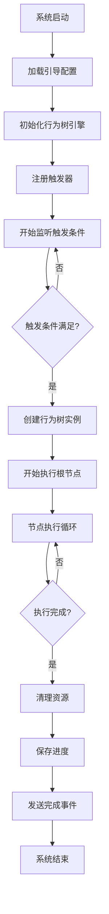
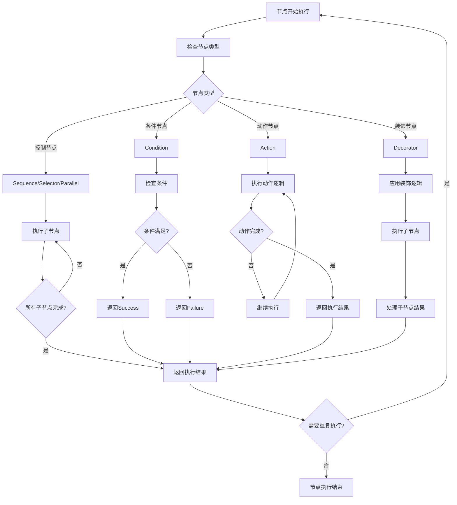
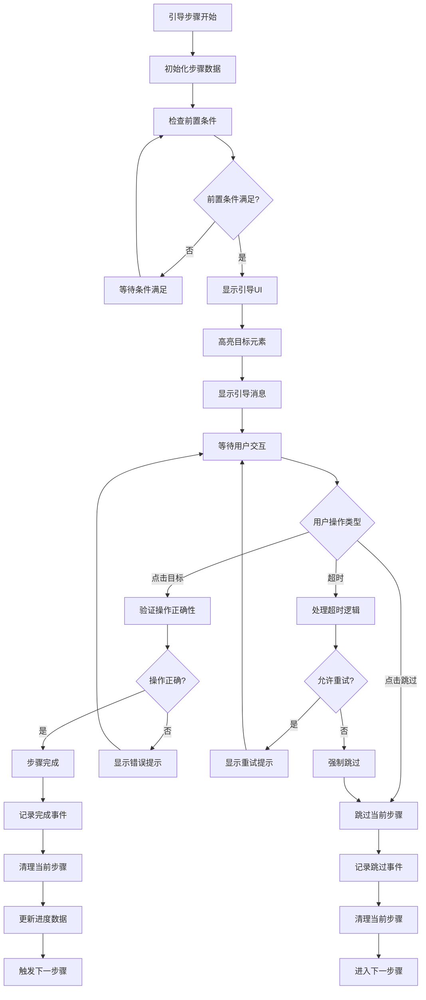
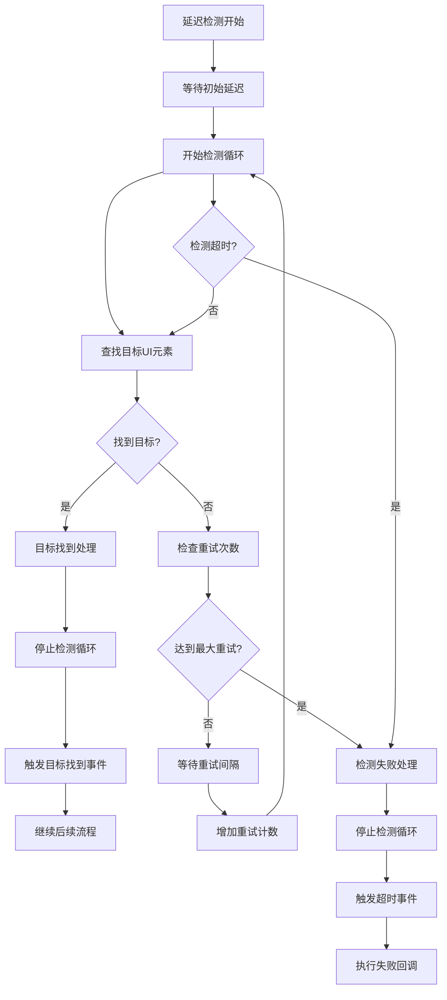
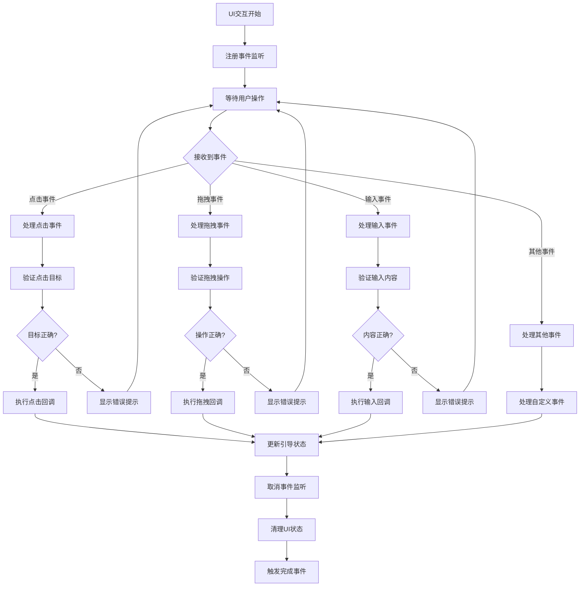
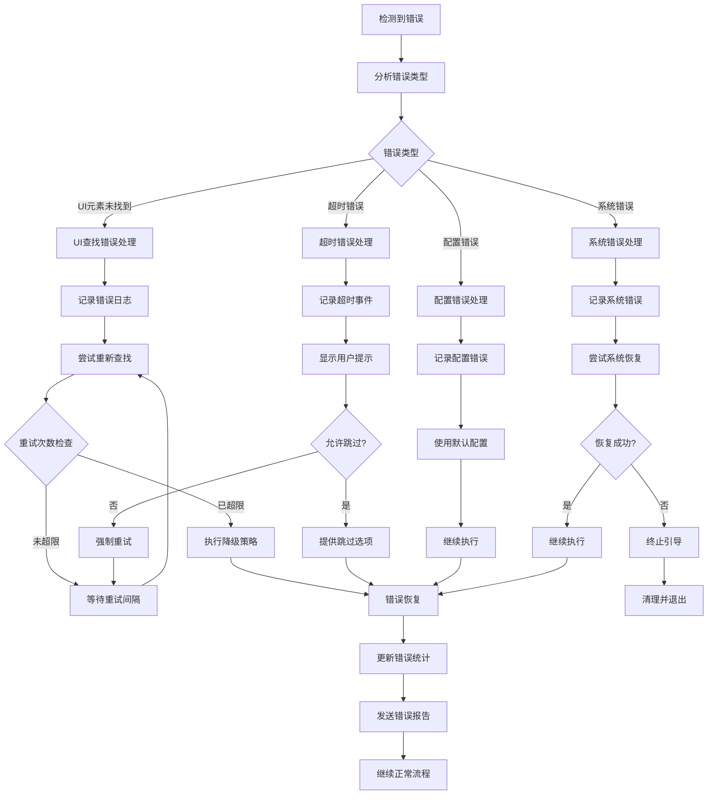
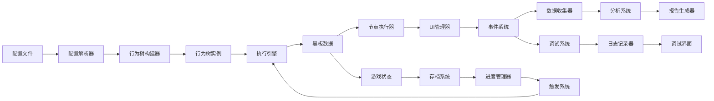
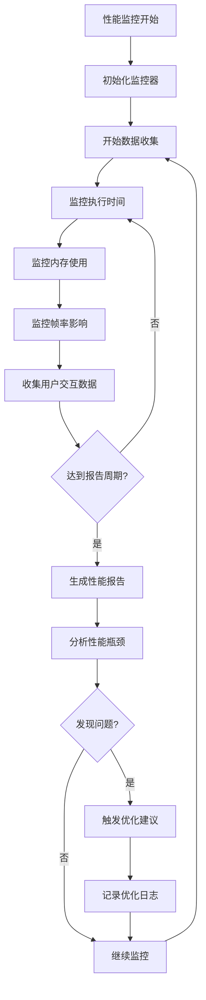
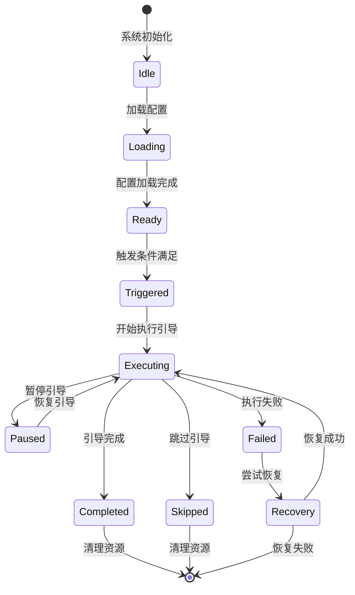
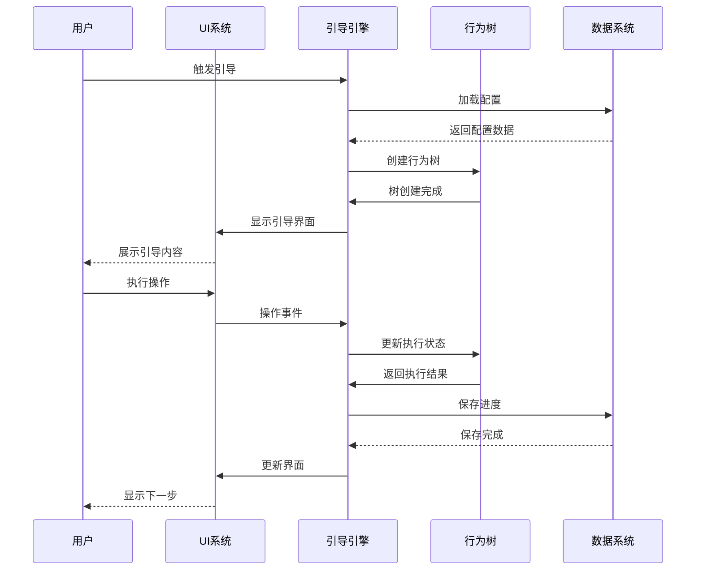

# 行为树新手引导系统执行流程图

## 1. 系统总体执行流程

## 2. 行为树节点执行流程

## 3. 引导步骤执行详细流程

## 4. 延迟检测机制流程

## 5. UI交互处理流程

## 6. 错误处理与恢复流程

## 7. 数据流转图

## 8. 性能监控流程

## 9. 状态机转换图

## 10. 关键时序图

## 流程图说明

### 设计特点
1. **模块化设计**：每个流程图专注于特定功能模块
2. **清晰的数据流**：明确显示数据在各组件间的流转
3. **完整的错误处理**：包含各种异常情况的处理流程
4. **性能监控**：集成性能监控和优化机制

### 关键流程
1. **主执行流程**：从系统启动到引导完成的完整流程
2. **节点执行**：行为树节点的详细执行逻辑
3. **交互处理**：用户交互的响应和处理机制
4. **错误恢复**：异常情况的检测和恢复策略

### 扩展性考虑
- 支持新节点类型的添加
- 支持自定义错误处理策略
- 支持插件式功能扩展
- 支持多种数据源和存储方式

这些流程图为行为树新手引导系统的开发提供了清晰的执行路径和设计指导，确保系统的稳定性和可维护性。