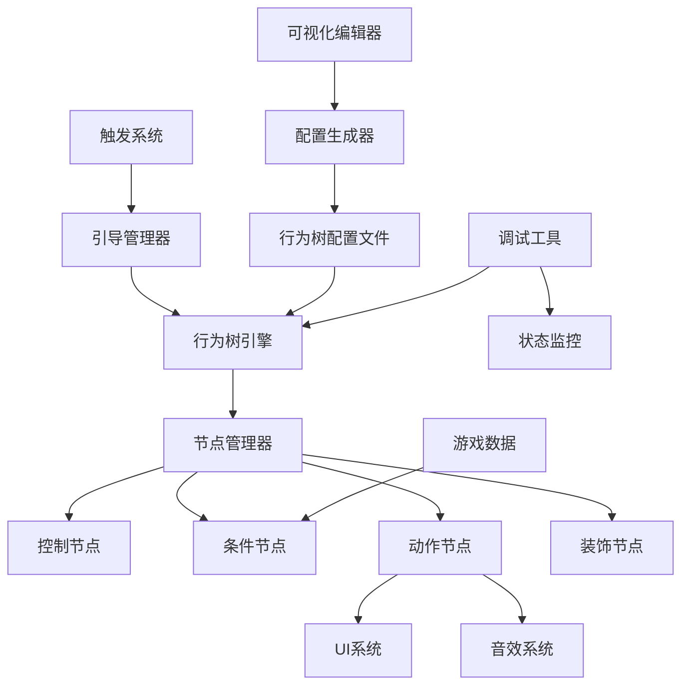

# 行为树新手引导系统设计文档

## 📋 文档信息

| 项目 | 信息 |
|------|------|
| **文档名称** | 行为树新手引导系统设计文档 |
| **版本** | v1.0.0 |
| **创建日期** | 2024年1月 |
| **文档类型** | 技术设计文档 |
| **目标读者** | 开发团队、技术负责人、架构师 |

---

## 🎯 1. 项目概述

### 1.1 项目背景

随着游戏复杂度的增加，传统的线性引导系统已无法满足复杂的引导需求。行为树作为一种强大的AI决策系统，具有良好的模块化、可视化和扩展性特点，非常适合用于构建复杂的新手引导系统。

### 1.2 设计目标

- **高度模块化**：每个引导行为都是独立的节点，便于复用和组合
- **强大的逻辑表达**：支持复杂的条件判断、并行执行、循环等控制流
- **可视化编辑**：提供直观的可视化编辑器，策划可以直接操作
- **动态适应**：根据玩家行为和游戏状态动态调整引导策略
- **易于调试**：完善的调试工具和状态监控机制

### 1.3 核心价值

- **降低开发成本**：通过可视化编辑减少代码编写量
- **提升引导质量**：支持更复杂和智能的引导逻辑
- **增强可维护性**：模块化设计便于维护和扩展
- **支持快速迭代**：可视化编辑支持快速调整引导流程

---

## 🏗️ 2. 系统架构设计

### 2.1 整体架构

```
行为树新手引导系统
├── 核心引擎层 (Core Engine)
│   ├── 行为树引擎 (Behavior Tree Engine)
│   ├── 节点管理器 (Node Manager)
│   ├── 执行调度器 (Execution Scheduler)
│   └── 状态管理器 (State Manager)
├── 节点库层 (Node Library)
│   ├── 控制节点 (Control Nodes)
│   ├── 条件节点 (Condition Nodes)
│   ├── 动作节点 (Action Nodes)
│   └── 装饰节点 (Decorator Nodes)
├── 引导业务层 (Tutorial Business)
│   ├── 引导管理器 (Tutorial Manager)
│   ├── 触发系统 (Trigger System)
│   ├── UI交互层 (UI Interaction)
│   └── 数据访问层 (Data Access)
├── 编辑器层 (Editor Layer)
│   ├── 可视化编辑器 (Visual Editor)
│   ├── 节点编辑器 (Node Editor)
│   ├── 调试工具 (Debug Tools)
│   └── 配置生成器 (Config Generator)
└── 配置数据层 (Configuration)
    ├── 行为树配置 (Tree Configs)
    ├── 节点参数配置 (Node Parameters)
    ├── 触发条件配置 (Trigger Conditions)
    └── 本地化配置 (Localization)
```

### 2.2 核心组件关系



---

## 🧩 3. 行为树节点设计

### 3.1 节点分类体系

#### 3.1.1 控制节点 (Control Nodes)

**Sequence（序列节点）**
- **功能**：按顺序执行子节点，全部成功才返回成功
- **应用场景**：连续的引导步骤，如"打开背包 → 选择装备 → 强化装备"
- **参数配置**：
  - `interruptOnFailure`: 失败时是否中断
  - `resetOnRestart`: 重启时是否重置状态

**Selector（选择节点）**
- **功能**：按顺序执行子节点，有一个成功就返回成功
- **应用场景**：多种引导路径选择，如"新手 OR 老玩家回归"
- **参数配置**：
  - `randomSelection`: 是否随机选择
  - `priority`: 子节点优先级

**Parallel（并行节点）**
- **功能**：同时执行多个子节点
- **应用场景**：同时进行多个引导，如"显示提示 + 播放音效 + 高亮按钮"
- **参数配置**：
  - `successPolicy`: 成功策略（全部成功/部分成功）
  - `failurePolicy`: 失败策略

#### 3.1.2 条件节点 (Condition Nodes)

**PlayerLevelCondition（玩家等级条件）**
- **功能**：检查玩家等级是否满足条件
- **参数**：`minLevel`, `maxLevel`, `operator`

**GameStateCondition（游戏状态条件）**
- **功能**：检查游戏状态
- **参数**：`stateName`, `expectedValue`, `comparison`

**UIStateCondition（UI状态条件）**
- **功能**：检查UI元素状态
- **参数**：`uiPath`, `property`, `expectedValue`

**TimeCondition（时间条件）**
- **功能**：检查时间相关条件
- **参数**：`timeType`, `duration`, `comparison`

#### 3.1.3 动作节点 (Action Nodes)

**ShowMessageAction（显示消息动作）**
- **功能**：显示引导消息
- **参数**：`message`, `duration`, `position`, `style`

**HighlightUIAction（高亮UI动作）**
- **功能**：高亮指定UI元素
- **参数**：`targetPath`, `highlightType`, `color`, `animation`

**WaitForClickAction（等待点击动作）**
- **功能**：等待玩家点击指定元素
- **参数**：`targetPath`, `timeout`, `allowSkip`

**PlayAudioAction（播放音效动作）**
- **功能**：播放引导音效
- **参数**：`audioClip`, `volume`, `loop`

**NavigateToSceneAction（场景跳转动作）**
- **功能**：跳转到指定场景
- **参数**：`sceneName`, `loadMode`, `transition`

#### 3.1.4 装饰节点 (Decorator Nodes)

**Repeater（重复装饰器）**
- **功能**：重复执行子节点
- **参数**：`repeatCount`, `repeatCondition`

**Inverter（反转装饰器）**
- **功能**：反转子节点的执行结果
- **参数**：无

**Cooldown（冷却装饰器）**
- **功能**：为子节点添加冷却时间
- **参数**：`cooldownTime`, `resetOnFailure`

**Timeout（超时装饰器）**
- **功能**：为子节点添加超时限制
- **参数**：`timeoutDuration`, `timeoutAction`

### 3.2 节点执行状态

```csharp
public enum NodeStatus
{
    Success,    // 成功
    Failure,    // 失败
    Running,    // 运行中
    Invalid     // 无效状态
}
```

---

## 🎮 4. 引导业务逻辑设计

### 4.1 引导管理器 (TutorialManager)

#### 4.1.1 核心职责
- **引导生命周期管理**：启动、暂停、恢复、停止引导
- **行为树实例管理**：创建、销毁、切换行为树实例
- **引导状态持久化**：保存和恢复引导进度
- **事件分发**：引导事件的监听和分发

#### 4.1.2 接口设计
```csharp
public interface ITutorialManager
{
    // 引导控制
    void StartTutorial(string tutorialId);
    void PauseTutorial();
    void ResumeTutorial();
    void StopTutorial();
    void SkipTutorial();
    
    // 状态查询
    bool IsTutorialActive();
    string GetCurrentTutorialId();
    float GetTutorialProgress();
    
    // 事件注册
    void RegisterTutorialEvent(string eventName, System.Action callback);
    void UnregisterTutorialEvent(string eventName, System.Action callback);
}
```

### 4.2 触发系统 (TriggerSystem)

#### 4.2.1 触发器类型
- **事件触发器**：基于游戏事件触发
- **条件触发器**：基于游戏状态条件触发
- **时间触发器**：基于时间条件触发
- **位置触发器**：基于玩家位置触发
- **组合触发器**：多种触发条件的组合

#### 4.2.2 触发优先级
```csharp
public enum TriggerPriority
{
    Critical = 0,    // 关键引导（如安全提示）
    High = 1,        // 高优先级（如核心功能引导）
    Normal = 2,      // 普通优先级（如一般功能引导）
    Low = 3,         // 低优先级（如提示性引导）
    Background = 4   // 后台引导（如数据收集）
}
```

### 4.3 数据访问层 (DataAccessLayer)

#### 4.3.1 数据提供者接口
```csharp
public interface IGameDataProvider
{
    // 玩家数据
    int GetPlayerLevel();
    float GetPlayerExperience();
    Dictionary<string, object> GetPlayerProperties();
    
    // 游戏状态
    string GetCurrentScene();
    GameMode GetGameMode();
    Dictionary<string, object> GetGameState();
    
    // UI状态
    bool IsUIVisible(string uiPath);
    object GetUIProperty(string uiPath, string property);
    
    // 自定义数据
    T GetCustomData<T>(string key);
    void SetCustomData<T>(string key, T value);
}
```

---

## 🎨 5. 可视化编辑器设计

### 5.1 编辑器功能需求

#### 5.1.1 核心功能
- **节点拖拽**：从节点库拖拽节点到画布
- **连线编辑**：通过拖拽创建节点间的连接
- **属性编辑**：选中节点后编辑节点属性
- **树结构预览**：显示完整的行为树结构
- **实时验证**：实时检查树结构的有效性

#### 5.1.2 高级功能
- **模板系统**：保存和复用常用的子树结构
- **版本控制**：支持行为树的版本管理
- **协作编辑**：支持多人同时编辑
- **性能分析**：分析行为树的执行性能
- **调试模式**：实时查看节点执行状态

### 5.2 编辑器界面设计

```
┌─────────────────────────────────────────────────────────────┐
│ 菜单栏: 文件 编辑 视图 工具 帮助                              │
├─────────────────────────────────────────────────────────────┤
│ 工具栏: 新建 打开 保存 撤销 重做 运行 调试                    │
├──────────┬──────────────────────────────────┬───────────────┤
│          │                                  │               │
│ 节点库   │           编辑画布                │   属性面板    │
│          │                                  │               │
│ ├控制节点│  ┌─────┐    ┌─────┐              │ ┌───────────┐ │
│ ├条件节点│  │节点1│───▶│节点2│              │ │节点属性   │ │
│ ├动作节点│  └─────┘    └─────┘              │ │           │ │
│ └装饰节点│       │                          │ │参数配置   │ │
│          │       ▼                          │ │           │ │
│          │  ┌─────┐                         │ └───────────┘ │
│          │  │节点3│                         │               │
│          │  └─────┘                         │               │
├──────────┴──────────────────────────────────┴───────────────┤
│ 状态栏: 当前文件 | 节点数量 | 验证状态 | 执行状态              │
└─────────────────────────────────────────────────────────────┘
```

### 5.3 节点可视化设计

#### 5.3.1 节点外观
- **形状区分**：不同类型节点使用不同形状
  - 控制节点：矩形
  - 条件节点：菱形
  - 动作节点：圆角矩形
  - 装饰节点：六边形

- **颜色编码**：使用颜色表示节点状态
  - 绿色：成功状态
  - 红色：失败状态
  - 黄色：运行中状态
  - 灰色：未执行状态

#### 5.3.2 连接线设计
- **线条类型**：实线表示正常连接，虚线表示条件连接
- **箭头方向**：明确显示执行流向
- **连接点**：节点的输入输出连接点

---

## 📊 6. 配置数据设计

### 6.1 行为树配置格式

#### 6.1.1 JSON配置结构
```json
{
  "tutorialId": "newbie_guide_001",
  "name": "新手引导-商店系统",
  "description": "引导新手了解商店系统的基本操作",
  "version": "1.0.0",
  "priority": "High",
  "triggers": [
    {
      "type": "PlayerLevelTrigger",
      "condition": {
        "minLevel": 3,
        "maxLevel": 5
      }
    }
  ],
  "behaviorTree": {
    "rootNode": {
      "id": "root_sequence",
      "type": "Sequence",
      "children": [
        {
          "id": "check_shop_unlocked",
          "type": "GameStateCondition",
          "parameters": {
            "stateName": "shop.unlocked",
            "expectedValue": true
          }
        },
        {
          "id": "show_welcome_message",
          "type": "ShowMessageAction",
          "parameters": {
            "message": "欢迎来到商店！让我们一起探索吧~",
            "duration": 3.0,
            "position": "center",
            "style": "bubble"
          }
        },
        {
          "id": "highlight_shop_button",
          "type": "HighlightUIAction",
          "parameters": {
            "targetPath": "MainUI/BottomPanel/ShopButton",
            "highlightType": "glow",
            "color": "#FFD700",
            "animation": "pulse"
          }
        },
        {
          "id": "wait_shop_click",
          "type": "WaitForClickAction",
          "parameters": {
            "targetPath": "MainUI/BottomPanel/ShopButton",
            "timeout": 30.0,
            "allowSkip": true
          }
        }
      ]
    }
  },
  "metadata": {
    "author": "策划团队",
    "createTime": "2024-01-15T10:00:00Z",
    "lastModified": "2024-01-15T15:30:00Z",
    "tags": ["新手", "商店", "基础功能"]
  }
}
```

### 6.2 节点参数配置

#### 6.2.1 参数类型系统
```csharp
public enum ParameterType
{
    String,      // 字符串
    Integer,     // 整数
    Float,       // 浮点数
    Boolean,     // 布尔值
    Vector2,     // 二维向量
    Vector3,     // 三维向量
    Color,       // 颜色
    Enum,        // 枚举
    Reference,   // 引用类型
    Array,       // 数组
    Object       // 复杂对象
}
```

#### 6.2.2 参数验证规则
```json
{
  "parameterDefinitions": {
    "message": {
      "type": "String",
      "required": true,
      "maxLength": 200,
      "localization": true
    },
    "duration": {
      "type": "Float",
      "required": false,
      "defaultValue": 3.0,
      "minValue": 0.1,
      "maxValue": 60.0
    },
    "targetPath": {
      "type": "String",
      "required": true,
      "validation": "ui_path",
      "autoComplete": true
    }
  }
}
```

---

## 🔧 7. 技术实现方案

### 7.1 核心技术选型

#### 7.1.1 行为树引擎
- **基础框架**：自研轻量级行为树引擎
- **执行模式**：基于协程的异步执行
- **内存管理**：对象池技术减少GC压力
- **性能优化**：节点缓存和增量更新

#### 7.1.2 可视化编辑器
- **技术栈**：Unity Editor + UIElements
- **图形渲染**：基于GraphView的节点图编辑器
- **数据绑定**：MVVM模式的数据绑定
- **插件架构**：支持自定义节点类型扩展

### 7.2 性能优化策略

#### 7.2.1 执行优化
- **惰性求值**：只在需要时计算条件节点
- **缓存机制**：缓存频繁访问的游戏数据
- **批量处理**：批量执行相同类型的操作
- **异步执行**：使用协程避免阻塞主线程

#### 7.2.2 内存优化
- **对象池**：复用节点实例和临时对象
- **弱引用**：避免循环引用导致的内存泄漏
- **资源管理**：及时释放不需要的资源
- **配置压缩**：压缩配置文件减少内存占用

### 7.3 扩展性设计

#### 7.3.1 节点扩展机制
```csharp
// 自定义节点基类
public abstract class CustomTutorialNode : BehaviorTreeNode
{
    // 节点元数据
    public abstract NodeMetadata GetMetadata();
    
    // 参数定义
    public abstract ParameterDefinition[] GetParameters();
    
    // 执行逻辑
    public abstract NodeStatus Execute(BehaviorTreeContext context);
    
    // 编辑器支持
    public virtual void OnDrawGizmos() { }
    public virtual void OnInspectorGUI() { }
}
```

#### 7.3.2 插件系统
- **节点插件**：支持第三方节点类型
- **触发器插件**：支持自定义触发器
- **数据源插件**：支持外部数据源接入
- **渲染插件**：支持自定义节点渲染

---

## 🧪 8. 调试与测试

### 8.1 调试工具设计

#### 8.1.1 实时调试器
- **执行可视化**：实时显示节点执行状态
- **变量监控**：监控关键变量的值变化
- **执行日志**：详细的执行日志记录
- **断点调试**：支持在节点上设置断点

#### 8.1.2 性能分析器
- **执行时间统计**：统计每个节点的执行时间
- **内存使用分析**：分析内存使用情况
- **热点检测**：检测性能热点
- **优化建议**：提供性能优化建议

### 8.2 测试策略

#### 8.2.1 单元测试
- **节点功能测试**：测试每个节点的基本功能
- **条件逻辑测试**：测试复杂的条件组合
- **边界情况测试**：测试异常和边界情况
- **性能基准测试**：建立性能基准

#### 8.2.2 集成测试
- **引导流程测试**：测试完整的引导流程
- **多场景测试**：测试跨场景的引导
- **并发测试**：测试多个引导同时执行
- **兼容性测试**：测试不同设备和版本的兼容性

---

## 📈 9. 数据分析与监控

### 9.1 数据埋点设计

#### 9.1.1 关键指标
- **引导完成率**：各个引导的完成率统计
- **跳过率**：引导被跳过的比例
- **卡点分析**：玩家在哪些步骤容易卡住
- **时长统计**：每个引导步骤的平均时长

#### 9.1.2 埋点事件
```json
{
  "eventType": "tutorial_step_start",
  "data": {
    "tutorialId": "newbie_guide_001",
    "stepId": "highlight_shop_button",
    "playerId": "player_12345",
    "timestamp": "2024-01-15T10:30:00Z",
    "gameContext": {
      "playerLevel": 3,
      "scene": "MainMenu",
      "sessionTime": 1800
    }
  }
}
```

### 9.2 实时监控

#### 9.2.1 监控面板
- **实时数据**：当前在线玩家的引导状态
- **异常告警**：引导执行异常的实时告警
- **性能监控**：系统性能指标监控
- **用户反馈**：用户对引导的实时反馈

---

## 🚀 10. 部署与运维

### 10.1 部署方案

#### 10.1.1 配置热更新
- **配置版本管理**：支持配置文件的版本控制
- **增量更新**：只更新变化的配置文件
- **回滚机制**：支持快速回滚到上一版本
- **A/B测试**：支持不同版本的A/B测试

#### 10.1.2 灰度发布
- **分批发布**：按用户群体分批发布新引导
- **风险控制**：实时监控发布效果，及时止损
- **用户分群**：基于用户特征进行精准投放

### 10.2 运维监控

#### 10.2.1 系统监控
- **服务状态**：引导服务的运行状态监控
- **资源使用**：CPU、内存、网络等资源监控
- **错误率监控**：引导执行错误率监控
- **响应时间**：引导响应时间监控

#### 10.2.2 业务监控
- **引导效果**：引导对业务指标的影响
- **用户行为**：用户在引导中的行为模式
- **转化漏斗**：引导各环节的转化率
- **留存分析**：引导对用户留存的影响

---

## 📋 11. 项目计划与里程碑

### 11.1 开发阶段规划

#### 第一阶段：核心引擎开发 (4-6周)
- **Week 1-2**: 行为树引擎核心架构
- **Week 3-4**: 基础节点库实现
- **Week 5-6**: 引导管理器和触发系统

#### 第二阶段：编辑器开发 (6-8周)
- **Week 7-10**: 可视化编辑器基础功能
- **Week 11-12**: 高级编辑功能和调试工具
- **Week 13-14**: 编辑器优化和用户体验改进

#### 第三阶段：业务集成 (4-6周)
- **Week 15-16**: 游戏业务逻辑集成
- **Week 17-18**: 数据分析和监控系统
- **Week 19-20**: 性能优化和稳定性测试

#### 第四阶段：测试与发布 (2-4周)
- **Week 21-22**: 全面测试和Bug修复
- **Week 23-24**: 文档完善和团队培训

### 11.2 关键里程碑

| 里程碑 | 时间 | 交付物 | 验收标准 |
|--------|------|--------|----------|
| **M1: 核心引擎完成** | Week 6 | 行为树引擎、基础节点库 | 能够执行简单的引导流程 |
| **M2: 编辑器Alpha版** | Week 10 | 可视化编辑器基础版本 | 能够创建和编辑行为树 |
| **M3: 编辑器Beta版** | Week 14 | 完整功能的编辑器 | 支持调试和高级功能 |
| **M4: 业务集成完成** | Week 20 | 完整的引导系统 | 能够在实际游戏中运行 |
| **M5: 系统发布** | Week 24 | 生产就绪的系统 | 通过所有测试，可以正式使用 |

---

## 🎯 12. 风险评估与应对

### 12.1 技术风险

#### 12.1.1 高风险项
- **性能风险**: 复杂行为树可能影响游戏性能
  - **应对策略**: 性能基准测试、优化算法、异步执行
- **兼容性风险**: 不同Unity版本的兼容性问题
  - **应对策略**: 多版本测试、向下兼容设计

#### 12.1.2 中等风险项
- **学习成本**: 团队需要学习行为树概念
  - **应对策略**: 培训计划、文档完善、示例丰富
- **调试复杂度**: 复杂行为树难以调试
  - **应对策略**: 强化调试工具、可视化执行过程

### 12.2 项目风险

#### 12.2.1 进度风险
- **开发周期**: 可能超出预期开发时间
  - **应对策略**: 分阶段交付、核心功能优先
- **资源投入**: 需要较多的开发资源
  - **应对策略**: 合理分配资源、外包部分工作

#### 12.2.2 业务风险
- **需求变更**: 业务需求可能频繁变化
  - **应对策略**: 灵活的架构设计、快速迭代能力
- **用户接受度**: 策划团队可能不适应新工具
  - **应对策略**: 用户体验优化、培训支持

---

## 📚 13. 附录

### 13.1 术语表

| 术语 | 定义 |
|------|------|
| **行为树** | 一种用于AI决策的树状数据结构 |
| **节点** | 行为树中的基本执行单元 |
| **控制节点** | 控制子节点执行顺序的节点 |
| **条件节点** | 用于判断条件的节点 |
| **动作节点** | 执行具体操作的节点 |
| **装饰节点** | 修饰子节点行为的节点 |
| **黑板** | 行为树中的共享数据存储 |
| **上下文** | 行为树执行时的环境信息 |

### 13.2 参考资料

- [Behavior Trees for AI: How they work](https://www.gamasutra.com/blogs/ChrisSimpson/20140717/221339/Behavior_trees_for_AI_How_they_work.php)
- [Unity Behavior Tree Implementation](https://docs.unity3d.com/Manual/BehaviorTrees.html)
- [Game AI Pro: Behavior Trees](https://www.gameaipro.com/)

### 13.3 版本历史

| 版本 | 日期 | 修改内容 | 作者 |
|------|------|----------|------|
| v1.0.0 | 2024-01-15 | 初始版本创建 | 开发团队 |

---

**文档结束**

> 本文档为行为树新手引导系统的完整设计方案，涵盖了从需求分析到技术实现的各个方面。在实际开发过程中，应根据项目具体情况对设计方案进行适当调整和优化。